## The High Cost of the Multi-Pass Illusion

Building a domain-specific language or programming language engine today is unnecessarily painful. The standard software
engineering playbook instructs developers to divide language implementation into distinct, isolated stages: a lexer
feeds a parser; the parser builds an abstract syntax tree (AST); a suite of visitor passes walks the AST to perform
name resolution, type checking, optimization, and evaluation; and a code generator finally traverses the tree once
more to emit target instructions.

```mermaid
graph LR
    Source["Source Code"] --> Lexer["Lexer"]
    Lexer --> Parser["Parser"]
    Parser --> AST["Abstract Syntax Tree (AST)"]
    AST --> Visitor1["Visitor Pass 1: Name Resolution"]
    Visitor1 --> Visitor2["Visitor Pass 2: Type Checking"]
    Visitor2 --> Visitor3["Visitor Pass 3: Optimization"]
    Visitor3 --> CodeGen["Code Generator / Evaluator"]
    CodeGen --> Output["Target Output / Result"]
```



This traditional separation looks tidy on a whiteboard, but in practice it imposes heavy tax. Every minor change to
language syntax requires updating AST node definitions, adjusting parser actions, and modifying every visitor pass
scattered across the codebase. More fundamentally, the AST is often a wasteful middleman. In many language
applications, the AST is constructed solely to be immediately traversed and discarded by an analyzer.

The core issue is that traditional parsers are passive recognizers. They match tokens against context-free rules
and yield inert tree structures, leaving all semantic interpretation to downstream passes. But formal language
theory offers a more elegant alternative:
[syntax-directed translation](https://www.geeksforgeeks.org/compiler-design/syntax-directed-translation-schemes/) and
[attribute grammars](https://en.wikipedia.org/wiki/Attribute_grammar). In an attribute grammar, semantic rules are
attached directly to grammar productions.

When a grammar is represented not as a static data file or a passive parser combinator tree, but as an executable
class whose productions are object-oriented methods, the grammar itself becomes the language engine. By combining
[derivative-based parsing](https://matt.might.net/articles/parsing-with-derivatives/), monadic context threading,
and grammar-native [contracts](https://en.wikipedia.org/wiki/Design_by_contract), [`@lapis-lang/lang-forma`](https://jsr.io/@lapis-lang/lang-forma) (LangForma)
collapses the entire language pipeline into unified, single-pass derivations. Syntax, static semantics, dynamic
semantics, and proof generation become different interpretations of the same executable class.

## The Engine: From Brzozowski Derivatives to Parsing with Zippers

To evaluate semantics directly during parsing, the underlying parser must be both powerful and flexible. It must
handle ambiguous grammars, left-recursive productions, and arbitrary context-sensitive rules without
getting stuck in infinite loops or requiring complex [grammar transformations](https://en.wikipedia.org/wiki/Dangling_else).

Classical parsing techniques fail this test. Top-down recursive descent parsers choke on left recursion
like $E \to E + T$. Bottom-up LR parsers handle left recursion but struggle with ambiguity and
context-dependent syntax, forcing developers into restrictive grammar classes.

In 1964, [Janusz Brzozowski](https://en.wikipedia.org/wiki/Janusz_Brzozowski_(computer_scientist))
introduced a radically simple technique: derivatives of regular expressions. While the derivative
symbol $\partial$ looks like calculus, taking the derivative of a language expression with respect
to a character $c$ has nothing to do with slopes or rates of change. It simply computes a new
expression that matches what remains after consuming character $c$.

Brzozowski defined the derivative $\partial_c R$ algebraically across regular expression constructors:

| Constructor | Rule | Intuition |
| --- | --- | --- |
| Matching Character | $\partial_c (c) = \epsilon$ | Consuming matching character $c$ leaves the empty string $\epsilon$, representing success |
| Non-Matching Character | $\partial_c (a) = \emptyset$ for $a \neq c$ | Consuming a non-matching character $a$ yields the empty set $\emptyset$ (failure) |
| Alternation (Choice) | $\partial_c (R_1 + R_2) = \partial_c R_1 + \partial_c R_2$ | Derivatives distribute across choice branches in parallel |
| Concatenation (Sequence) | $\partial_c (R_1 R_2) = (\partial_c R_1) R_2 + \delta(R_1) \partial_c R_2$ | Differentiates the first term, threading derivative context downstream |
| Kleene Star (Repetition) | $\partial_c (R^*) = (\partial_c R) R^*$ | Differentiates the repeating body, preserving the tail loop |

To see derivative computation in action over $R = \text{\texttt{(foo|frak|bar)*}}$: taking the derivative of $R$ with respect to `'f'`
applies the Kleene star rule to differentiate the inner choice $(R_1 + R_2 + R_3)$, yielding:

$$\partial_{\text{'f'}} \, \text{\texttt{(foo|frak|bar)*}} = (\partial_{\text{'f'}} \, \text{\texttt{(foo|frak|bar)}}) \, \text{\texttt{(foo|frak|bar)*}} = \text{\texttt{(oo|rak)(foo|frak|bar)*}}$$

Consuming `'f'` matches the prefix of `foo` or `frak`, reducing those branches to `oo` and `rak`, while leaving `bar` as $\emptyset$ (which drops out) and preserving the tail repetition. Parsing an entire input string $c_1 c_2 \dots c_n$ reduces to repeatedly taking derivatives character by character:

$$\partial_{c_n} (... \partial_{c_2} (\partial_{c_1} R)...)$$

If the final derivative expression contains the empty string $\epsilon$ (representing success), the input string is valid.

While Brzozowski originally applied derivatives to regular expressions, the technique was limited to regular
languages recognizable by finite automata, meaning it could not handle recursive nesting like balanced
parentheses or arbitrary context-free grammars. In 2011, Matthew Might et al.
[extended derivatives](https://matt.might.net/articles/parsing-with-derivatives/)
from regular expressions to full context-free grammars (and recursive parser combinators) by using
laziness and functional memoization. However, taking derivatives rewrites grammar trees at every
character step. For complex or ambiguous grammars, alternative branches duplicate sub-trees, causing
exponential graph expansion and making online equivalence checks on cyclic graphs expensive,
especially when semantic actions carry arbitrary runtime values. Memoization helps, but the underlying
execution model still rewrites the grammar graph at every character step, which is a performance bottleneck.

[Parsing with Zippers](https://michaeldadams.org/papers/parsing-with-zippers/) (PwZ), formulated by
Pierce Darragh and Michael D. Adams in 2020, solves this performance bottleneck by changing the
execution model. PwZ does not rewrite the grammar graph character by character. Instead, it leaves the
grammar tree fixed in memory and advances lightweight cursors, known as [zippers](https://wiki.haskell.org/Zipper),
through the tree nodes.

Think of the grammar as a static maze and each zipper as a navigator exploring a path with a shared
notebook. As characters arrive, zippers step forward from node to node. When two zippers arrive at
the same grammar node at the same input position, they share memoized results rather than duplicating
work. This memoization turns potential exponential blowup into polynomial time, while seamlessly
handling left-recursive productions by seeding and growing memo tables at recursive entry points.

Because a zipper's position after processing $k$ tokens represents a complete derivative state for
the suffix $[k, n)$, the engine natively supports advanced capabilities like incremental re-parsing,
parallel segment parsing, and error recovery without requiring structural grammar transformations.

## Syntax as Structure: Executable Grammars in Object-Oriented Code

In 2007, [Gilad Bracha](https://bracha.org/) proposed the concept of [executable grammars](https://bracha.org/executableGrammars.pdf)
in the Newspeak programming language. Bracha observed that context-free grammar productions map directly
to class methods:

- A production $A \to B \quad C$ corresponds to a method named `a` that invokes parsers `b` and `c`.
- Alternation ($A \to B \mid C$) corresponds to choice combinators (`or`).
- Concatenation corresponds to sequence combinators (`seq`).

The LangForma library serves as the modern TypeScript synthesis of these ideas.
By unifying Brzozowski derivatives, zipper memoization, and Bracha's executable grammars, it elevates
syntax specification from a passive configuration format into first-class object-oriented code.

In LangForma, an executable grammar is defined as a TypeScript class inheriting
from `Grammar<S>`. Productions are declared using the `@rule` decorator on class getters or methods.

::code-group

```ebnf [Textbook EBNF]
Expr   ::= Term '+' Expr | Term ;
Term   ::= Factor '*' Term | Factor ;
Factor ::= '(' Expr ')' | Number ;
```

```ts [Executable Grammar Class]
import { Grammar, rule, char, or, seq } from '@lapis-lang/lang-forma';

interface MathShape {
  [k: string]: unknown;
  expr: number;
  term: number;
  factor: number;
}

class MathEval extends Grammar<MathShape> {
  start() { return this.expr; }

  // Expression: E -> T + E | T
  @rule get expr() {
    return or(
      seq(this.term, char('+'), this.expr).map(([t, , e]) => t + e),
      this.term,
    );
  }

  // Term: T -> F * T | F
  @rule get term() {
    return or(
      seq(this.factor, char('*'), this.term).map(([f, , t]) => f * t),
      this.factor,
    );
  }

  // Factor: F -> (E) | Number
  @rule get factor() {
    return or(
      seq(char('('), this.expr, char(')')).map(([, e]) => e),
      this.digits.map((s) => Number(s)),
    );
  }
}
```

::

This object-oriented representation unlocks structural inheritance for language design. Because
productions are class methods, a subclass can override individual grammar rules to extend or
alter syntax while inheriting the rest of the language definition:

```ts
class TracedMath extends MathEval {
  readonly trace: number[] = [];

  // Override the expr production to log every computed value.
  @rule override get expr() {
    return super.expr.map((value) => {
      this.trace.push(value);
      return value;
    });
  }
}
```

Furthermore, shape-typed grammars (`Grammar<S>`) parameterize per-production result types across the class.
An abstract grammar class can define production shapes without committing to a concrete return type,
allowing subclasses to instantiate the same syntax for AST building, evaluation, or type checking while
preserving type safety in TypeScript.

A key engineering challenge in class-based executable grammars is self-reference: recursive rules like
`expr` referencing `this.expr` or `this.term` can trigger infinite recursion during class instantiation
if evaluated eagerly. In standard functional parser combinator libraries (excepting Haskell), developers
must manually wrap recursive terms in explicit lazy thunks like `() => this.expr()`. Borrowing a technique
from Bracha's Newspeak implementation, LangForma eliminates explicit thunks entirely.
The `@rule` decorator wraps recursive production properties with hidden lazy proxies
(using `DelayedExp` nodes). When a production method is called or accessed, the decorator transparently
returns a proxy slot that resolves lazily when the zipper driver traverses the grammar tree.
This allows grammar authors to write natural object-oriented expressions without cluttering semantic
logic with manual lazy closures.

### Parameterized Rules for Context-Sensitive Grammars

Because production rules are methods on a class rather than static tree definitions, `@rule` can
decorate methods that take runtime parameters. This enables first-class support for context-sensitive
syntax without grammar transformations or external lexer state hacking.

For example, parsing indentation-sensitive languages (like Python or YAML) requires checking that
nested blocks match or exceed a required indentation depth. By declaring `@rule block(depth: number)`,
the method accepts `depth` as a parameter. The `@rule` decorator caches a separate memoized slot
per `(instance, method, args)` tuple, so calling `this.block(2)` and `this.block(4)` creates two distinct,
mutually-recursive parser nodes that execute cleanly within the zipper engine:

```ts
class IndentLang extends Grammar<{ doc: Node[] }> {
  override start() { return this.block(0); }

  // Block(depth) ::= Line(depth) Block(depth) | ε
  @rule block(depth: number): Parser<Node[]> {
    return seq(this.line(depth), this.block(depth).opt())
      .map(([first, rest]) => [first, ...(rest ?? [])]);
  }
}
```

## Semantics as Syntax-Directed Derivations: Monadic Context Threading

A grammar that only recognizes syntax is half a tool. To turn an executable grammar into a semantics
engine, semantic attributes must flow through the parse traversal. LangForma achieves
this by representing formal [attribute grammars](https://en.wikipedia.org/wiki/Attribute_grammar) as
executable TypeScript classes.

Attribute grammars categorize semantic information into two directions:

1. **Synthesized attributes** flow bottom-up. A child node computes a value and passes it up to its parent.
    In LangForma, synthesized attributes are represented directly as the return values of
    `.map()` callbacks (or the return values of `@rule` methods).
2. **Inherited attributes** flow top-down. A parent passes contextual information down to its children,
    such as a variable environment $\rho$ or a typing environment $\Gamma$. In LangForma,
    inherited attributes are represented as method arguments passed into parameterized `@rule` methods (e.g.
    `exprProd(ctx: TypeEnv)`).

The correspondence between textbook attribute grammars and LangForma class constructs is direct:

| Attribute Grammar Concept | LangForma Class Equivalent |
| --- | --- |
| Production $A \to B \quad C$ | `@rule` method returning `Parser<T>` |
| Synthesized Attribute ($A.val$) | `.map(([b, c]) => ...)` return value |
| Inherited Attribute ($B.ctx$) | Parameterized `@rule expr(ctx)` method argument |
| Semantic Rule in $[ \text{brackets} ]$ | `.map()` callback function |
| L-Attributed Threading | `chain(first, fn)` monadic bind |

In formal attribute grammars, an [L-attributed grammar](https://en.wikipedia.org/wiki/L-attributed_grammar)
requires that inherited attributes for a parse node depend only on inherited attributes of the parent or
synthesized attributes of left siblings. In a standard parser combinator library, sequencing multiple
parsers via `seq(a, b)` constructs both `a` and `b` eagerly at initialization time. But if parser `b`
requires context derived from the output of parser `a`, eager construction fails because `a` has not yet
executed.

For example, when parsing a variable declaration `let x: Int = 42 in expr`, the type checker cannot parse
`expr` until `x` has been added to the typing environment $\Gamma$. Passing the initial environment $\Gamma$
to both `x` and `expr` eagerly via `seq(this.varDecl(ctx), this.expr(ctx))` fails because `expr` would be
parsed under the un-extended environment $\Gamma$ rather than $\Gamma \cup \{x \mapsto \text{Int}\}$.

The `chain` combinator (monadic bind) solves this sequencing problem. It executes the first parser, captures its synthesized result, and passes that result to a factory function that constructs the second parser dynamically:

::code-group

```text [Attribute Grammar Spec]
LambdaProd -> "lambda" Ident ":" Type "." Expr
  [ Expr.env = Ctx.extend(Ident.name, Type.val) ]
  [ LambdaProd.val = Abs(Ident.name, Type.val, Expr.val) ]
```

```ts [Monadic Context Threading]
@rule
protected lambdaProd(ctx: TypeEnv): Parser<Type> {
  return seq(
    literal('lambda'), ws1(), this.ident, char(':'), this.type, char('.'),
  ).chain(([, , param, , ty]) =>
    // Monadic bind: ty is computed; extend environment and parse body.
    this.exprProd(ctx.extend(param, ty))
      .map((bodyType) => new TFun(ty, bodyType))
  ).map(([, result]) => result);
}
```

::

By deferring the construction of the second parser until the first parser completes, monadic context threading
allows top-down inherited attributes and bottom-up synthesized attributes to interleave cleanly in a single pass.

## Grammar-Native Contracts: Inference Rules as Code

[Design by Contract (DbC)](https://en.wikipedia.org/wiki/Design_by_contract), pioneered by [Bertrand Meyer](https://en.wikipedia.org/wiki/Bertrand_Meyer)
in [Eiffel](https://en.wikipedia.org/wiki/Eiffel_(programming_language)), traditionally enforces software
correctness using preconditions (`@requires`), postconditions (`@ensures`), and class invariants (`@invariant`).
In standard software systems, a violated assertion is treated as a fatal software bug, immediately raising an
unhandled exception to abort execution.

LangForma adapts Design by Contract (inspired by my earlier contract library [`@final-hill/decorator-contracts`](https://www.npmjs.com/package/@final-hill/decorator-contracts))
to the parsing and derivation domain, turning method contracts into declarative logical inference rules centered around contract blame:

1. **Preconditions (`@requires`) and Caller Blame**: In classic DbC, a violated precondition assigns blame to the **caller**
  for providing invalid input arguments. In LangForma, the "caller" is the parsing engine
  evaluating a derivation branch. When a `@requires` precondition fails on a production method, caller blame
  indicates that the current grammar rule or inference premise does not apply to this input. Instead of throwing
   an exception, the contract system catches the failure gracefully and reduces the branch to an empty parse
   forest (`empty()`), pruning the invalid derivation branch and allowing alternative rules to be explored
   automatically.
2. **Postconditions (`@ensures`) and Callee Blame**: A violated postcondition assigns blame to the **callee**
  (the decorated production method itself) for failing to deliver its promised return value despite receiving
  valid inputs. In an executable grammar, callee blame represents a genuine defect in the language implementation
  (such as a type-checking method returning `undefined` or an ill-formed type). Because callee failure is a logic
  error in the grammar code rather than a parse mismatch, it throws a fatal `ContractError` exception.
3. **Class Invariants (`@invariant`)**: Class invariants assign blame to the object instance for violating
  structural integrity before or after method execution. In LangForma, invariants guarantee
  well-formedness of the grammar engine across derivations.
4. **Subcontracting via Liskov Substitution**: Contracts automatically compose across object-oriented class
  inheritance hierarchies following the Liskov Substitution Principle. Preconditions are OR-ed (weakened in
  subclasses so callers have fewer restrictions), while postconditions and invariants are AND-ed (strengthened
  in subclasses so callees guarantee tighter contracts).

This domain-specific adaptation bridges imperative software contracts with formal programming language theory.
In formal logic and type systems, static semantics are specified using horizontal fraction bars called
[inference rules](https://en.wikipedia.org/wiki/Rule_of_inference) (or natural deduction rules). If you have
never encountered them in a textbook, they are easier to read than they look.

An inference rule is a logical implication written upside-down:

$$\frac{\text{Premise 1} \quad \text{Premise 2}}{\text{Conclusion}} \quad (\text{Rule-Name})$$

The statements above the horizontal line are the **premises** (what must be true beforehand). The statement below
the line is the **conclusion** (what becomes true if all premises hold).

For example, consider the classic application rule from type systems, known as **T-App** which is used to
type-check function application expressions $e_1 \, e_2$:

$$\frac{\Gamma \vdash e_1 : \tau_1 \to \tau_2 \quad \Gamma \vdash e_2 : \tau_1}{\Gamma \vdash e_1 \, e_2 : \tau_2} \quad (\text{T-App})$$

Deconstructing the symbols reveals a straightforward concept:
- The turnstile symbol $\vdash$ (read as "proves" or "yields") states that under a typing environment
  $\Gamma$ (a symbol table mapping variable names to types), an expression has a given type.
- The top left premise $\Gamma \vdash e_1 : \tau_1 \to \tau_2$ says: "in environment $\Gamma$, expression
  $e_1$ is a function taking input type $\tau_1$ and returning output type $\tau_2$."
- The top right premise $\Gamma \vdash e_2 : \tau_1$ says: "in environment $\Gamma$, expression $e_2$ has
  type $\tau_1$."
- The bottom conclusion $\Gamma \vdash e_1 \, e_2 : \tau_2$ concludes: "therefore, applying function $e_1$ to
  argument $e_2$ yields a result of type $\tau_2$."

In traditional compiler code, this mathematical rule is buried inside imperative `if` statements and nested
`switch` blocks, mixing control flow with semantic rules. LangForma aligns executable method
decorators directly with formal inference rules:

- **Premises above the line** become `@requires` preconditions on rule methods.
- **Conclusions below the line** become `@ensures` postconditions on rule methods.


```ts
import { requires, ensures, typeEq } from '@lapis-lang/lang-forma';

// Premise: fn must be a function type whose domain matches arg.
@requires((_self, fn: Type, arg: Type) =>
  fn instanceof TFun && typeEq(fn.dom, arg),
  { rule: 'T-App', role: 'premise', formula: 'fn : dom -> cod  AND  arg == dom' }
)
// Conclusion: the resulting type must be a valid Type instance.
@ensures((_self, _args, _old, result: Type) =>
  result instanceof TVar || result instanceof TFun,
  { rule: 'T-App', role: 'conclusion', formula: 'result : cod' }
)
protected app(fn: Type, _arg: Type): Type {
  return (fn as TFun).cod;
}
```

In addition to enforcing runtime correctness, these decorators accept schema-less metadata objects attached
directly to `@rule`, `@requires`, `@ensures`, and `@invariant`.

Using the static getter `Grammar.metadata`, the framework aggregates contract predicates and metadata objects
across the entire class inheritance chain (most-derived first). This reflective capability transforms the
executable grammar class into a self-documenting logical specification. By defining a simple report method
on a grammar class, developers can:

1. **Print Complete Formal Rule Sets**: Iterate over `Grammar.metadata` to extract and print the language's
  entire set of natural deduction inference rules, ASCII/LaTeX formulas, and premises without writing a
  separate documentation site.
2. **Derive Proof Trees and Traceability**: Build formal proof trees during type checking by pairing executed
  contract predicates with their reflective metadata, attaching exact rule names (`T-App`, `T-Var`) to derivation
  nodes.
3. **Generate IDE Diagnostics & Error Messages**: Extract exact premise formulas on contract failure, giving
  IDE language servers descriptive error diagnostics (for example, "Type Mismatch in T-App: expected argument
  type Int, received Bool") automatically.
4. **Automate Test Generation**: Reflectively inspect method preconditions (`requires`) to synthesize
  edge-case inputs for property-based test suites.

## Core Exemplar: Simply Typed Lambda Calculus

To see how these concepts unite into a single framework, consider the
[Simply Typed Lambda Calculus](https://en.wikipedia.org/wiki/Simply_typed_lambda_calculus) (STLC). STLC is the
canonical baseline language in programming language theory. It contains three core constructs:

| STLC Construct | Notation | Meaning |
| --- | --- | --- |
| Variable Reference | $x$ | Looks up a bound symbol in the environment |
| Function Abstraction | $\lambda x : \tau . e$ | Defines a function with parameter $x$ of type $\tau$ and body $e$ |
| Function Application | $e_1 \, e_2$ | Applies function $e_1$ to argument $e_2$ |

In a traditional implementation, STLC requires a parser module, an AST definition file, a type checker class,
and an interpreter module. In LangForma, a single abstract grammar defines the language shape,
and specialized subclasses instantiate four distinct interpretations over the same syntax.

```ts
interface STLCShape {
  [k: string]: unknown;
  expr: unknown;
  atom: unknown;
  type: unknown;
}

abstract class AbstractSTLC<S extends STLCShape> extends Grammar<S> {
  protected abstract varRef(name: string, ctx: unknown): S['expr'];
  protected abstract abs(param: string, paramType: S['type'], body: S['expr']): S['expr'];
  protected abstract app(fn: S['expr'], arg: S['expr']): S['expr'];

  @rule exprProd(ctx: unknown): Parser<S['expr']> {
    return or(
      this.absProd(ctx),
      this.appProd(ctx),
      this.atomProd(ctx),
    );
  }
  // Abstract production rules defined using this.varRef, this.abs, this.app...
}
```

From this single abstract definition, we instantiate four distinct interpretations in TypeScript code:

### 1. Concrete Parse Tree Construction

By extending `AbstractSTLC` with concrete AST node types, the grammar acts as a standard parser that outputs
structured syntax trees:

```ts
class STLCParseTree extends AbstractSTLC<{ expr: ASTNode; atom: ASTNode; type: Type }> {
  protected varRef(name: string): ASTNode {
    return { kind: 'var', name };
  }

  protected abs(param: string, paramType: Type, body: ASTNode): ASTNode {
    return { kind: 'abs', param, paramType, body };
  }

  protected app(fn: ASTNode, arg: ASTNode): ASTNode {
    return { kind: 'app', fn, arg };
  }
}
```

### 2. One-Pass Type Checking ($\Gamma \vdash e : \tau$)

By extending `AbstractSTLC` where the expression result type is `Type`, method arguments carry the typing
environment $\Gamma$ top-down as inherited attributes, and rule methods return verified types $\tau$ bottom-up.
Ill-typed terms fail preconditions or lookup guards and return an empty parse forest (`empty()`) without
crashing the process:

```ts
class STLCTypeCheck extends AbstractSTLC<{ expr: Type; atom: Type; type: Type }> {
  @requires((_self, name, ctx) =>
    ctx instanceof TypeEnv && ctx.lookup(name) !== undefined)
  protected varRef(name: string, ctx: TypeEnv): Type {
    return ctx.lookup(name)!;
  }

  protected abs(param: string, paramType: Type, body: Type): Type {
    return new TFun(paramType, body);
  }

  @requires((_self, fn, arg) =>
    fn instanceof TFun && typeEq(fn.dom, arg))
  @ensures((_self, _args, _old, result) =>
    result instanceof TVar || result instanceof TFun)
  protected app(fn: Type, _arg: Type): Type {
    return (fn as TFun).cod;
  }
}
```

### 3. One-Pass Evaluation (Higher-Order Attributes)

Dynamic evaluation of lambda abstractions requires evaluating function bodies under extended value environments
$\rho$. When applying a closure $(\lambda x . e) \, v$, the closure body $e$ must be evaluated under
 $\rho [x \mapsto v]$.

Using `parseSegment`, the evaluator captures the source substring of the closure body and re-enters the grammar
engine to parse and evaluate the segment under the updated environment in a single pass without building an
intermediate AST:

```ts
class STLCEval extends AbstractSTLC<{ expr: Value; atom: Value; type: Type }> {
  protected varRef(name: string, env: ValEnv): Value {
    return env.lookup(name);
  }

  protected abs(param: string, paramType: Type, body: unknown, span: Span): Value {
    // Capture closure body source span and current value environment
    return new Closure(param, span, this.currentEnv);
  }

  protected app(fn: Value, arg: Value): Value {
    if (!(fn instanceof Closure)) throw new Error('TypeError: expected function');
    const extendedEnv = fn.env.extend(fn.param, arg);
    // Re-enter the grammar over the body's source span using the extended environment
    return [...this.parseSegment(this.input, fn.bodySpan.start, this.exprProd(extendedEnv), fn.bodySpan.end)][0]!;
  }
}
```

Per-pass memo isolation ensures that nested re-entry stays safe and avoids state leakage across recursive
evaluation steps.

### 4. Proof-Bearing Type Checking & Rule Set Reporting

By pairing semantic actions with contract metadata, the type checker returns both the computed type $\tau$ and
a formal proof tree documenting every applied typing rule. Furthermore, because contracts and rules carry
reflective metadata, defining a `reportRules()` method lets the grammar class print out its own complete
formal inference rule set:

```ts
class STLCProofChecker extends STLCTypeCheck {
  // Print out the complete natural deduction rule set from class metadata
  static reportRules(): string {
    const meta = Grammar.metadataOf(STLCTypeCheck);
    return Object.entries(meta.methods)
      .map(([name, info]) => {
        const premises = info.requires.map((r) => r.meta?.formula ?? 'true').join('  AND  ');
        const conclusion = info.ensures[0]?.meta?.formula ?? 'valid';
        return `Rule [${info.rule?.meta?.rule ?? name}]:\n  Premises:   ${premises}\n  Conclusion: ${conclusion}`;
      })
      .join('\n\n');
  }

  // Type-check and return a ProofNode tree along with the resulting type
  protected override app(fn: Type, arg: Type): ProofNode {
    const resultType = (fn as TFun).cod;
    return new ProofNode('T-App', `\Gamma |- app : ${resultType}`, [fn.proof, arg.proof]);
  }
}
```

Beyond STLC, executable grammars handle specialized language features easily:

- **Context-Sensitive Syntax**: Indentation-sensitive block parsing (like Python or YAML) is implemented by
  passing current indentation depth integers as parameters to `@rule block(depth: number)`.
- **Circular Attribute Flow**: Mutual recursion in `let rec` bindings is resolved using `parseToFixpoint`, which
  iterates evaluation over handler bodies until context environments converge.

## Boundary Conditions and Multi-Pass Alternatives

Single-pass syntax-directed evaluation is powerful, but it is not a universal solution for every compiler phase.
Certain program analyses inherently require multi-pass processing over retained derivation structures:

- Global program optimizations (such as dead code elimination or inline expansion across module boundaries).
- Whole-program control flow graph (CFG) construction.
- Circular attribute dependencies that cannot be resolved in a single left-to-right pass.

When an application requires multi-pass processing, forcing everything into inline parse callbacks can clutter
grammar definitions. LangForma accommodates this requirement through `parseToTree`.

Instead of executing inline semantic actions, `parseToTree` captures matched `@rule` productions, source spans,
and parent-child relationships into a first-class `DerivationTree`. Developers then subclass `SemanticPass`
to write decoupled passes over the tree:

```ts
class TypeCheckPass extends SemanticPass<{ expr: Type; term: Type }> {
  expr(node: DerivationNode, children: Type[]): Type {
    // Process pre-parsed derivation nodes over retained tree
    return children[0]!;
  }
}
```

This design preserves flexibility. Developers can use single-pass executable grammars for fast, inline semantics,
while switching to retained derivation trees for complex multi-pass compiler transformations.

## Program Generation & Unparsing: The Dual of Parsing

Parsing consumes tokens bottom-up to build semantic values. Generation is the dual: it walks the grammar's `Exp`
tree top-down, emitting tokens and computing semantic values. This is [L-system](https://en.wikipedia.org/wiki/L-system)
style expansion: starting from an initial production (the axiom), the generator expands non-terminals until
terminals are reached. A single executable grammar class is therefore both a recognizer *and* a producer of the
language it defines.

```ts
const g = new MathEval();
const { value, tokens, tree } = g.generate({
  seed: 42,
  maxDepth: 4,
});
const src = tokens.map((t) => t.sym).join('');  // e.g. "3*2"
// Round-trip: parse the generated source back through the same grammar
[...g.parse(src)];  // → [6]
```

The generator is deterministic for a given `seed`, so generated programs are reproducible. Generation respects the
grammar's own structure (including recursive and parameterized productions), so every emitted program is
syntactically well-formed by construction. The depth ceiling, recursion cap, and branch ordering are tunable, but
the point is structural: the same executable class that *recognizes* a language can also *produce* it, and the two
directions agree by construction.

To make the L-system connection concrete, consider the [Sierpinski triangle](https://en.wikipedia.org/wiki/Sierpi%C5%84ski_triangle),
a classic fractal generated by rewriting a single axiom through two recursive productions. The grammar is
trivially small, yet its generative expansion produces a structure of unbounded depth:

```ts
import { Grammar, rule, or, seq, char, epsilon } from '@lapis-lang/lang-forma';

// Sierpinski L-system:  A -> B A B,  B -> A B A,  terminals A, B
class Sierpinski extends Grammar<{ axiom: string }> {
  start() { return this.axiom; }

  @rule get axiom() {
    return or(
      seq(this.b, this.a, this.b).map(([x, y, z]) => x + y + z),  // A -> B A B
      this.b,                                                     // A -> B  (base)
    );
  }

  @rule get b() {
    return or(
      seq(this.a, this.b, this.a).map(([x, y, z]) => x + y + z),  // B -> A B A
      char('B').map(() => 'B'),                                    // B -> B  (terminal)
    );
  }
}

const g = new Sierpinski();
const { tokens } = g.generate({ seed: 0, maxDepth: 3 });
tokens.map((t) => t.sym).join('');
// "BABABABA" — the Sierpinski sequence at depth 3
```

The same class can parse that string back: `[...g.parse('BABABABA')]` succeeds because the generator and the
recognizer share one grammar definition. The fractal emerges from the same recursive productions that define the
language.

### Generating from a Named Production

Generation is not limited to the start symbol. `generateFrom(ruleName, args?, options?)` resolves any `@rule`
production reflectively, including parameterized (method) productions, so you can synthesize terms from any
non-terminal in the grammar. This is what makes the generator useful as a test oracle: it can target the exact
production whose contract you want to exercise.

### Unparsing (Inverse Parsing)

`Grammar.unparse(tree)` converts a `DerivationTree` back to source text. The default `UnparsePass` reconstructs
from source spans (zero-config), but the real value is transformation: a pretty-printer subclass can normalize
spacing, enforce a canonical style, or emit an entirely different surface syntax from the same tree:

```ts
import { SemanticPass, type DerivationNode } from '@lapis-lang/lang-forma';

// Pretty-printer: normalizes "1+2*3" to "1 + 2 * 3" with canonical spacing
class PrettyMath extends SemanticPass<Record<string, string>> {
  expr(node: DerivationNode, children: string[]): string {
    return children.join(' + ');  // insert spaces around '+'
  }
  term(node: DerivationNode, children: string[]): string {
    return children.join(' * ');  // insert spaces around '*'
  }
  factor(node: DerivationNode, children: string[]): string {
    return children.join('');     // no spaces inside parens
  }
}

const { trees } = g.parseToTree('1+2*3');
g.unparse(trees[0], new PrettyMath());  // -> "1 + 2 * 3"
```

The input `"1+2*3"` and the output `"1 + 2 * 3"` differ, which is the point: unparsing is not an identity
function. The same `DerivationTree` that feeds multi-pass semantic analysis (see
[Boundary Conditions](#boundary-conditions-and-multi-pass-alternatives)) also feeds the unparser, so a single
structural parse supports evaluation, type checking, and pretty-printing without re-parsing.

### Native Property-Based Testing

[Property-based testing](https://en.wikipedia.org/wiki/Property_testing) inverts the usual test workflow. Instead
of writing individual cases with fixed inputs and expected outputs, the developer states a *property* that should
hold for all valid inputs, and a test framework generates hundreds of inputs to search for a counterexample.
The technique originated in Haskell's [QuickCheck](https://en.wikipedia.org/wiki/QuickCheck); its strength is that
it explores edge cases the author of hand-written tests would not think to cover.

For a language implementation, the inputs are programs, and the properties are semantic invariants. The arithmetic
grammar from earlier only contains digits, `+`, and `*`. That constrains the output: every result should be a
non-negative integer. Rather than hard-coding `2 + 3` and asserting it yields `5`, the generator produces hundreds
of well-formed expressions and checks the invariant structurally:

```ts
const g = new MathEval();
const gen = g.toGenerator({ maxDepth: 5 });

// Property 1: every generated expression evaluates to a finite number.
// A NaN or Infinity here would expose a bug in the evaluator.
gen.forAll(
  (n) => typeof n === 'number' && Number.isFinite(n),
  { numRuns: 100 },
);

// Property 2: every result is a non-negative integer.
// The grammar only has digits, '+', and '*', so no result should
// be negative or fractional. A failure here catches a sign error
// or an accidental floating-point operation.
gen.forAll(
  (n) => Number.isInteger(n) && n >= 0,
  { numRuns: 100 },
);
```

When a property fails, the generator does not just report the failing input. It *shrinks*: re-generating at
shallower depths to find the minimal term that still triggers the failure. A counterexample that crashes on
`((1 + 2) * (3 + 4)) + 5` shrinks to something like `1 + 0`, exposing the root cause. Because the generator
respects the grammar's structure, every shrunk counterexample is itself a syntactically valid program.

## Metatheory Verification: Progress and Preservation

The two metatheorems (theorems *about* a formal system, rather than within it) that establish type safety for a language are **Progress** and **Preservation** (Subject
Reduction), classically formulated by [Wright and Felleisen](https://courses.grainger.illinois.edu/cs522/sp2016/ASyntacticApproachToTypeSoundness.pdf):

- **Progress**: A well-typed term is either a value or can take an evaluation step; it never gets *stuck*.
- **Preservation**: If a well-typed term takes a step, the result is well-typed at the same type.

Traditionally these are proven by induction in a proof assistant like [Rocq](https://rocq-prover.org/) or [Lean](https://lean-lang.org/). LangForma verifies them by
*analyzing the grammar class itself*, combining three layers:

1. **Static rule-structure analysis**: `verifyMetatheory(evalClass, typeCheckClass)` (and the `Grammar.metatheory`
   static getter) classifies each evaluation rule (`E-*`) and checks that the dynamic semantics covers every
   well-typed term (Progress) and that rule conclusions are consistent with their premises (Preservation). Gaps
   are reported with explanations.
2. **Unification-based implication checking**: a built-in relational unification engine checks that each step's
   output type implies its input type. Results are exposed via `metatheory.preservation.unification`.
3. **Generative counterexample search**: `findCounterexamples(evalGrammar, typeCheckGrammar, { numRuns, seed, generator })`
   uses the [program generator](#program-generation--unparsing-the-dual-of-parsing) to synthesize well-formed
   terms, type-checks and evaluates them, and reports any concrete counterexample that violates Progress or
   Preservation.

```ts
import { verifyMetatheory, findCounterexamples } from '@lapis-lang/lang-forma';
import { STLCEval, STLCTypeCheck } from './stlc.ts';

// Static analysis + unification (Progress + Preservation):
const report = STLCEval.metatheory;
console.log(report.progress.holds);     // true
console.log(report.preservation.holds); // true

// Generative counterexample search:
const ev = new STLCEval();
const tc = new STLCTypeCheck();
const search = findCounterexamples(ev, tc, { numRuns: 100, seed: 42 });
console.log(search.passed); // true
```

### Annotating Dynamic Semantics

To verify Progress and Preservation, the dynamic-semantics rules (evaluation judgments $\rho \vdash e \Downarrow v$)
must be annotated with `@requires`/`@ensures` metadata following the same `rule`/`formula` convention as the
static semantics. The layout maps directly to the decorator positions:

```
premise₁   premise₂   …    if ϕ
─────────────────────────  ruleName  (production)
conclusion                 provided ψ
```

Premises (`@requires`) appear above the bar; the conclusion (`@ensures`) appears below. An optional `role` key
distinguishes **side conditions** (`@requires` with `role: "side"`, rendered as `if ϕ` to the right of the
premises above the bar) and **frame conditions** (`@ensures` with `role: "frame"`, rendered as `provided ψ` to
the right of the conclusion below the bar). When `role` is omitted, `@requires` defaults to `"premise"` and
`@ensures` to `"conclusion"`:

```ts
@requires(
  (_self, fn, _arg) => fn instanceof Closure,
  { rule: 'E-App', formula: 'ρ ⊢ e₁ ⇓ ⟨x,τ,span,ρ′⟩' },
)
@ensures(
  (_self, _args, _old, result) => isValueOrPlaceholder(result),
  { rule: 'E-App', formula: 'ρ ⊢ e₁ e₂ ⇓ v' },
)
protected override app(fn: Value, arg: Value): Value { /* ... */ }
```

### First-Class Inference Rules

Grammars that annotate `@requires`/`@ensures` with `meta.rule` get first-class `InferenceRule` objects via
`Grammar.rules`, a structured, opt-in interpretive layer over the schema-less `Grammar.metadata` shown in
[Proof-Bearing Type Checking](#4-proof-bearing-type-checking--rule-set-reporting):

```ts
const rules = STLCTypeCheck.rules;
const tApp = rules.find((r) => r.name === 'T-App')!;
tApp.premises;    // [{ formula: "fn : σ → τ  ∧  arg <: σ", ... }]
tApp.conclusion;  // [{ formula: "result : τ", ... }]
tApp.production;  // "appProd"
console.log(tApp.format());
// fn : σ → τ    arg <: σ
// ──────────────────────────  T-App  (appProd)
// result : τ
```

Each rule's `format()` renders standard proof-tree notation: premises (`@requires`) above the bar, the
conclusion (`@ensures`) below, the rule name and production on the bar line. Side conditions render as
`if ϕ` and frame conditions as `provided ψ`. This is the same metadata the metatheory engine consumes, so the
specification, the runtime checks, the documentation, and the proof search all derive from one source.

## Grammars as Executable Proof Systems

The traditional separation between parsing, static analysis, and runtime evaluation is often an artifact of tool
limitations rather than essential language design. When parsers are limited to passive token matching,
developers are forced to build extensive boilerplate code to bridge syntax and semantics.

By building on zipper derivatives, monadic context threading, and grammar-native contracts,
LangForma demonstrates that an executable class can serve as a complete language
specification. Grammars are no longer just text recognizers; they are executable proof systems that unify syntax,
static semantics, and dynamic semantics within a clean object-oriented architecture.

The dual operations round this out. Running a grammar *backwards* turns it into an L-system style program
generator and pretty-printer, so a single class is both a recognizer and a producer of the language it defines.
And because the contract metadata already encodes the language's inference rules, the engine can turn that
specification inward and verify its own type-safety metatheorems (Progress and Preservation) without an
external proof assistant. Grammars are no longer just text recognizers or even proof systems; they are
self-documenting, self-generating, and self-verifying language engines.

For language designers, DSL authors, and compiler engineers, this approach offers what I think is a compelling
path forward: less translation boilerplate, tighter alignment with formal models, and executable specifications
that serve as their own documentation, their own test oracles, and their own proof assistants.

---

## References and Further Reading

- Pierce Darragh & Michael D. Adams, ["Parsing with Zippers"](https://michaeldadams.org/papers/parsing-with-zippers/parsing-with-zippers.pdf), ICFP 2020.
- Gilad Bracha, ["Executable Grammars in Newspeak"](https://bracha.org/executableGrammars.pdf), ENTCS 2007.
- Matthew Might, David Darais & Daniel Spiewak, ["Parsing with Derivatives: A Functional Pearl"](https://matt.might.net/papers/might2011derivatives.pdf), ICFP 2011.
- Janusz A. Brzozowski, ["Derivatives of Regular Expressions"](https://dl.acm.org/doi/10.1145/321239.321249), Journal of the ACM, 11(4): 481-494, 1964.
- Bertrand Meyer, ["Applying 'Design by Contract'"](https://se.inf.ethz.ch/~meyer/publications/computer/contract.pdf), IEEE Computer, 25(10): 40-51, 1992.
- Donald E. Knuth, ["Semantics of Context-Free Languages"](https://sci-hub.su/10.1007/bf01692511), Mathematical Systems Theory, 2(2): 127-145, 1968.
- Michael Haufe, ["@final-hill/decorator-contracts"](https://www.npmjs.com/package/@final-hill/decorator-contracts), npm registry.
- Benjamin C. Pierce, ["Types and Programming Languages"](https://www.cis.upenn.edu/~bcpierce/tapl/), MIT Press, 2002.
- Andrew W. Wright & Matthias Felleisen, ["A Syntactic Approach to Type Soundness"](https://courses.grainger.illinois.edu/cs522/sp2016/ASyntacticApproachToTypeSoundness.pdf), Information and Computation, 115(1): 38-94, 1994.
