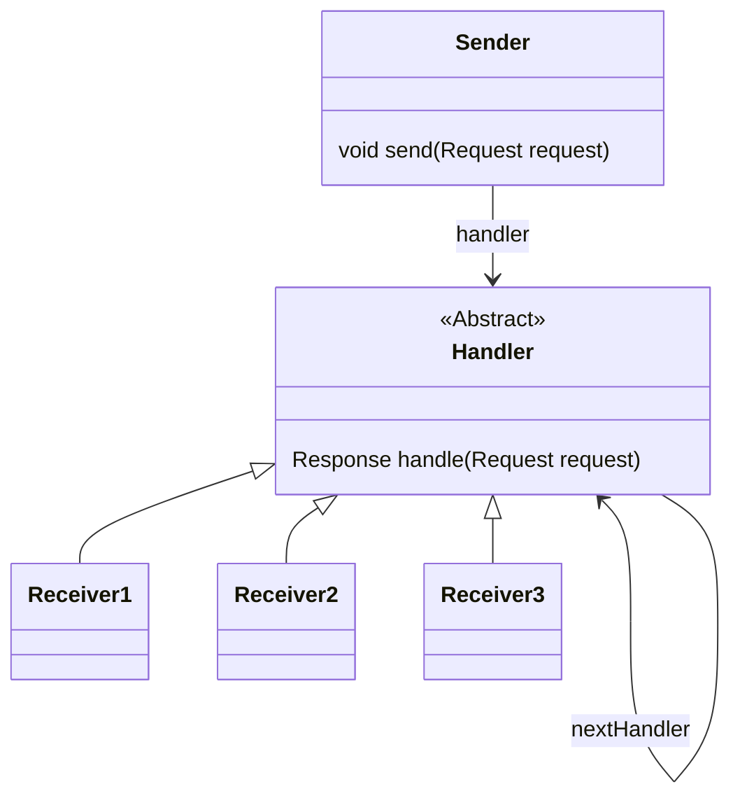
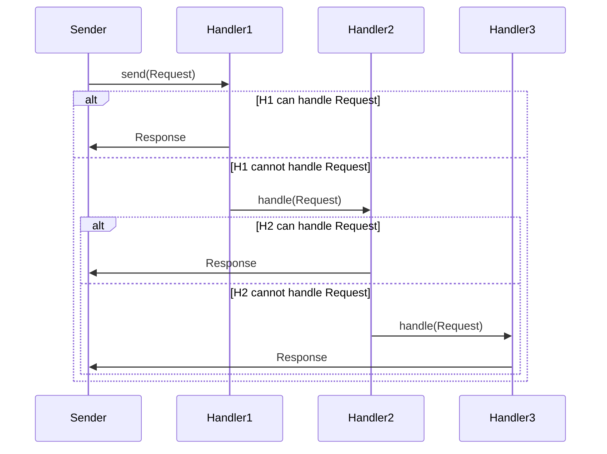

## Introduction

[Peter Norvig](https://www.norvig.com/) has famously said that _"Design patterns are bug reports against your programming language"_.
A popular design pattern still in use today is the _chain of responsibility_ pattern, which allows an object to pass a request along
a chain of potential handlers who can process and/or pass the request further along the chain. The key goal here being
that the sender of the request does not need to know which handler will ultimately process the request, enabling loose coupling
between the sender and the handlers.

Despite the loose-coupling benefits, to implement this pattern in a traditional object-oriented programming language
often requires a fair amount of boilerplate code to set up the chain of handlers and the logic for passing requests along the chain.
However, in JavaScript, we can leverage its prototypal inheritance model plus Proxies to enable a more elegant solution known as _comb inheritance_.

## The Chain of Responsibility Pattern

Objects are intended to be self-contained units of behavior and state. However, in many scenarios, an object may not be able to handle
a request on its own. For example, consider a logging system where different loggers handle messages of varying severity levels.
In these cases, the chain of responsibility pattern allows an object to delegate
the request to the next object in a chain until one of the objects can handle it.

Here is how a chain of responsibility is structured:



Sequentially, when a `Sender` sends a `Request`, it invokes the `handle` method on its associated `Handler`.
If the `Handler` can process the `Request`, it does so and returns a `Response`. If not, it forwards the `Request` to its `nextHandler`.



## Logger Example

As a practical example, consider a logging system with three handlers: `InfoHandler`, `WarningHandler`, and `ErrorHandler`.
Each handler is responsible for processing messages of a specific severity level. If a handler cannot handle a message,
it passes the message to the next handler in the chain. The `Logger` acts as the `Sender` and exposes a natural `log()` action.

```javascript
class Handler {
  constructor(next) { this.next = next; }
  handle(request) {
    return this.canHandle(request)
      ? this.process(request)
      : this.next?.handle(request);
  }
  canHandle(request) { throw new Error('Must implement canHandle()'); }
  process(request) { throw new Error('Must implement process()'); }
}

class Sender {
  constructor(handler) { this.handler = handler; }
  send(request) { this.handler.handle(request); }
}

class InfoHandler extends Handler {
  canHandle({ level }) { return level === 1; }
  process({ message }) { console.log(`Info: ${message}`); }
}

class WarningHandler extends Handler {
  canHandle({ level }) { return level === 2; }
  process({ message }) { console.warn(`Warning: ${message}`); }
}

class ErrorHandler extends Handler {
  canHandle({ level }) { return level === 3; }
  process({ message }) { console.error(`Error: ${message}`); }
}

class Logger extends Sender {
  log(level, message) { this.send({ level, message }); }
}

const error = new ErrorHandler(),
    warning = new WarningHandler(error),
    info = new InfoHandler(warning);

const logger = new Logger(info);
logger.log(1, "This is an informational message.");
logger.log(2, "This is a warning message.");
logger.log(3, "This is an error message.");
```

## Comb Inheritance

The Logger example above illustrates the chain of responsibility concept well, but notice how much boilerplate is required: abstract base classes, explicit `handle()` methods, `canHandle()` and `process()` abstractions, and manual chain setup. What if we could make this pattern more implicit and natural?

Enter **Comb Inheritance**, a form of multiple inheritance pioneered by [NewtonScript](https://en.wikipedia.org/wiki/NewtonScript), the programming language developed for Apple's Newton platform in the 1990s. The name "comb" comes from the visual appearance when you diagram the inheritance structure - it looks like a comb with two distinct paths (or "teeth"):

1. **The prototype chain (`_proto`)** - Traditional prototype-based inheritance for shared behavior and default values
2. **The parent chain (`_parent`)** - Instance-based delegation for context-specific behavior

Here's how the two paths work together:

```
GrandParent ──> GrandParent.prototype ──> Object.prototype
    ↑
    │ _parent
    │
Parent ──> Parent.prototype ──> Object.prototype
    ↑
    │ _parent
    │
Child ──> Child.prototype ──> Object.prototype
```

When looking up a property on `Child`:
1. Check `Child`'s own properties
2. Walk up the prototype chain: Child.prototype &rarr; Object.prototype
3. If not found, delegate to `Parent` instance and repeat from step 1
4. If still not found, delegate to `GrandParent` instance and repeat from step 1

This creates a powerful composition pattern where objects can inherit both from type hierarchies (prototypes) and from contextual relationships (parents).

## Implementing Comb Inheritance in JavaScript

JavaScript's prototypal inheritance naturally handles the `_proto` path, so we only need to add the `_parent` path. We can achieve this simply enough using a Proxy to intercept property lookups:

```javascript
// WeakMap to store parent references outside of the proxy system
const parentMap = new WeakMap()

// Component is the base constructor for objects that support Comb Inheritance.
// It establishes the parent chain by accepting an optional parent instance.
function Component(parent = null) {
    parentMap.set(this, parent)
}

// Getter to access parent
Object.defineProperty(Component.prototype, 'parent', {
    get() {
        return parentMap.get(this)
    }
})

// Wrap Component.prototype with a Proxy to handle parent delegation
Component.prototype = new Proxy(Component.prototype, {
    get(target, prop, receiver) {
        // Preserve JavaScript invariants for symbols
        if (typeof prop === 'symbol')
            return Reflect.get(target, prop, receiver)

        // 1. Check prototype chain FIRST (includes own properties)
        if (prop in target) {
            const value = Reflect.get(target, prop, receiver)
            return typeof value === 'function' ? value.bind(receiver) : value
        }

        // 2. Delegate to parent instance (recursively)
        const parent = parentMap.get(receiver)
        if (parent) {
            const value = parent[prop]  // Re-enters proxy for recursive lookup
            if (value !== undefined) {
                // Bind functions to parent instance for proper super.method() calls
                return typeof value === 'function' ? value.bind(parent) : value
            }
        }

        return undefined
    }
})
```

What's notable in this implementation is that accessing `parent[prop]` automatically re-enters the proxy's get trap, handling the entire parent chain recursively without explicit loops.

## Revisiting the Logger Example

With Comb Inheritance, our logger chain becomes dramatically simpler:

```javascript
class InfoLogger extends Component {
    log(request) {
        return request.level === 1 ?
            console.log(`Info: ${request.message}`) :
            super.log(request); // Delegates to parent instance
    }
}

class WarningLogger extends Component {
    log(request) {
        return request.level === 2 ?
            console.warn(`Warning: ${request.message}`) :
            super.log(request);
    }
}

class ErrorLogger extends Component {
    log(request) {
        return request.level === 3 ?
            console.error(`Error: ${request.message}`) :
            super.log(request);
    }
}

// Set up the chain by passing parent instances
const error = new ErrorLogger(),
    warning = new WarningLogger(error),
    info = new InfoLogger(warning);

// Use it naturally
info.log({ level: 1, message: "This is an informational message." });
info.log({ level: 2, message: "This is a warning message." });
info.log({ level: 3, message: "This is an error message." });
```

Notice how we've eliminated:
- The abstract `Handler` base class
- The `handle()`, `canHandle()`, and `process()` methods
- The `Sender` wrapper class
- All the boilerplate for managing the `next` handler

The chain of responsibility is now implicit in the inheritance structure itself. When `super.log()` is called and the method doesn't exist on the prototype, the Proxy intercepts and delegates to the parent instance, seamlessly implementing the pattern.

## Document Hierarchies

Comb Inheritance shines in scenarios where objects need both type-based and context-based behavior:

Consider a document system where pages inherit both formatting rules from their template class (prototype chain) and specific overrides from their container hierarchy (parent chain):

```javascript
// Template classes define shared defaults via prototype chain
class DocTemplate extends Component {
    paperSize = 'letter'

    // Shared method on prototype
    getMargins() {
        return `Top: ${this.topMargin || 'default'}, Bottom: ${this.bottomMargin || 'default'}`
    }
}

class PageTemplate extends DocTemplate {  // Inherits from DocTemplate
    topMargin = 1.0
    bottomMargin = 1.0
    leftMargin = 1.25
    rightMargin = 1.25
}

// Create document instances with parent chain
const techManual = new DocTemplate()
techManual.paperSize = 'legal'          // Override for this document
techManual.footerText = 'Confidential'  // Document-specific property

const chapter3 = new DocTemplate(techManual)
chapter3.headerText = 'Chapter 3: Safety'  // Chapter-specific

const page42 = new PageTemplate(chapter3)
page42.topMargin = 1.5                  // Page-specific override

// Demonstrates both inheritance paths:
console.log(page42.topMargin)       // 1.5 (own property)
console.log(page42.leftMargin)      // 1.25 (from PageTemplate.prototype)
console.log(page42.headerText)      // 'Chapter 3: Safety' (from parent chapter3)
console.log(page42.footerText)      // 'Confidential' (from grandparent techManual)
console.log(page42.getMargins())    // 'Top: 1.5, Bottom: 1'
                                    // Method from DocTemplate.prototype
                                    // Uses page42's own topMargin and inherited bottomMargin
```

This example showcases both "teeth" of the comb:
- **Prototype chain** (horizontal): `page42` &rarr; PageTemplate.prototype &rarr; DocTemplate.prototype &rarr; Component.prototype
  - Provides `leftMargin`, `rightMargin`, `bottomMargin` (default 1.0), `paperSize` (default 'letter'), and `getMargins()` method
- **Parent chain** (vertical): `page42` &rarr; `chapter3` &rarr; `techManual`
  - Provides `headerText` and `footerText` from specific document instances

## Event Propagation

A UI framework where events naturally bubble up the component hierarchy without explicit listener registration:

```javascript
// Base component class with event handling via prototype
class UIComponent extends Component {
    // Shared event handling method on prototype
    handleEvent(event) {
        const handler = this[`on${event.type}`]
        if (handler) {
            handler.call(this, event)
            if (event.stopped) return  // Stop if handler called stopPropagation
        }

        // Bubble to parent if not stopped
        if (this.parent && !event.stopped) {
            this.parent.handleEvent(event)
        }
    }
}

class Button extends UIComponent {
    constructor(label, parent) {
        super(parent)
        this.label = label
    }

    onclick(event) {
        console.log(`Button "${this.label}" clicked`)
        // Event continues to bubble by default
    }
}

class Panel extends UIComponent {
    constructor(name, parent) {
        super(parent)
        this.name = name
    }

    onclick(event) {
        console.log(`Panel "${this.name}" received click`)
    }
}

class Window extends UIComponent {
    constructor(title) {
        super(null)  // Top-level, no parent
        this.title = title
    }

    onclick(event) {
        console.log(`Window "${this.title}" received click`)
        event.stopped = true  // Stop propagation at window level
    }
}

// Build UI hierarchy using parent chain
const mainWindow = new Window('App')
const sidebar = new Panel('Sidebar', mainWindow)
const saveButton = new Button('Save', sidebar)

// Trigger event - it bubbles up automatically through parent chain
saveButton.handleEvent({ type: 'click', stopped: false })
// Output:
// Button "Save" clicked
// Panel "Sidebar" received click
// Window "App" received click
```

The event system leverages both inheritance paths:
- **Prototype chain**: `handleEvent()` method is shared across all UIComponent instances via prototype
- **Parent chain**: Events automatically propagate up the component hierarchy (`saveButton` → `sidebar` → `mainWindow`)

This eliminates the need for explicit event listener registration, event emitters, or manual propagation logic. The UI hierarchy itself defines the event propagation path.

## Conclusion

Comb Inheritance demonstrates how we can eliminate the need for a number of Object-Oriented design patterns as separate constructs.
By making the chain of responsibility implicit in the inheritance mechanism itself, we reduce boilerplate, improve clarity, and make our code more maintainable.

While NewtonScript introduced this concept in the 1990s, JavaScript's dynamic nature and Proxy support make it a possible to reintroduce this for modern applications.
As we've seen through the logger, document hierarchy, and event propagation examples, this pattern naturally fits scenarios where objects need both type-based behavior (via prototypes)
and context-specific delegation (via parent instances).

The implementation is available on NPM at [@mlhaufe/comb-inheritance](https://www.npmjs.com/package/@mlhaufe/comb-inheritance), complete with tests for all examples presented in this article.

## References and Further Reading

- [The NewtonScript Programming Language](https://www.newted.org/download/manuals/NewtonScriptProgramLanguage.pdf), Chapter 5: Inheritance and Lookup
- [Attack of the Clones](https://www.researchgate.net/publication/228870018_Attack_of_the_Clones), by James Noble and Brian Foote; Section "Chain of Responsibility"
- [Chain-of-responsibility pattern](https://en.wikipedia.org/wiki/Chain-of-responsibility_pattern) - Wikipedia
